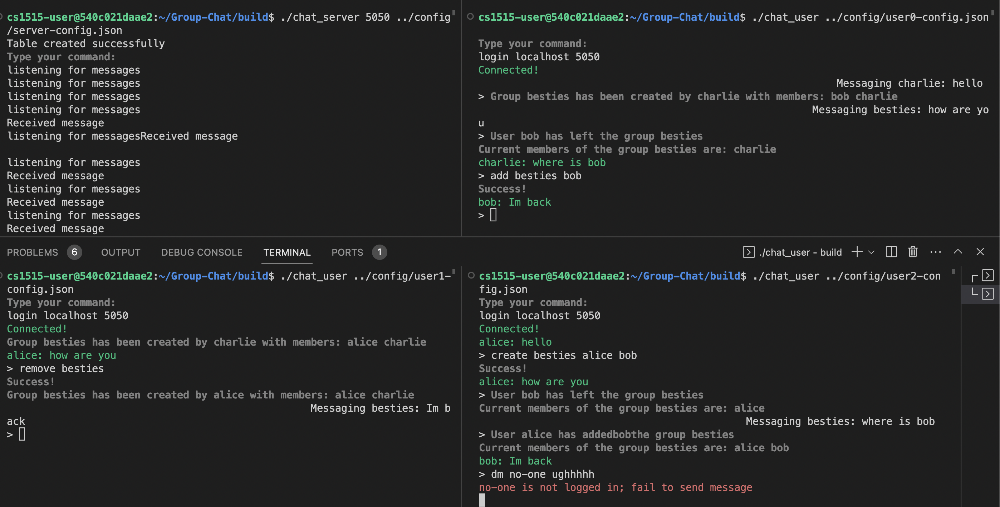

# Secure Group Chat

## Overview
This project implements a signal-style secure chat system that enables multiple users to communicate over a central server. It uses CryptoPP and Boost libraries for cryptographic algorithms and networking functionality.

### Server
The project applies a central server because it is more efficient and scalable for multi-user communication. It is implemented with multithreading to handle multiple user connections concurrently. It also acts as a central authority responsible for verifying clients and issuing certificates with digital signiture.

### User
The users must either register or log in with the server to retrieve their certificate by providing a valid password and responding to a two-factor authentication challenge. Once obtained, the users can securely communicate with each other using the certificates, effectively preventing impersonation attacks.

In addition to direct messaging other users, users have the ability to create group chats and perform basic administrative functions, such as adding and removing group members.

### Security Premises
#### Diffie-Hellman Key Exchange
Users would run the DH key exchange protocol with both the server and other intended recipients for secure communication. Messages are encrypted using the shared key between the sender and recipient to protect them from the server. Additionally, the messages are encrypted again using the shared key between the server and the sender.

#### Semi-honest Server
The server is assumed to forward the messages to given users without compromising the confidentiality of messages. The group messages are sent to the server as multiple direct messages from a user to other users, preventing the server from deducing explicit group structures. 

## Demo

## Running the code
To build the project, `cd` into the `build` folder and run `cmake ..`. This will generate a set of Makefiles building the whole project. From here, you can run `make` to generate a binary (`chat_user` and `chat_server`) you can run, and you can run make check to run any tests you write in the test folder.

### Server
To run the server binary, run `./chat_server <port> <config file>`. We have provided server config files for you to use; you shouldn't need to change them. Afterwards, the server will start listening for connections and handle them in separate threads.

- list registered users: `$ users`
- reset registered users: `$ reset`

### User
To run the user binary, run `./chat_user <config file>`. You may find example users from the `config` folder. 

#### Full Command List
- login and connect: `$ login <address> <port>`
- register and connect: `$ register <address> <port>`
- direct message: `$ dm <userID> <message>`
- create group: `$ create <groupID> <userID> [userID] [userID] ...`
- group message: `$ gm <groupID> <message>`
- add member to group: `$ add <groupID> <userID>`
- remove self from group: `$ rm <groupID>`
- list groups and members: `$ groups`
- disconnect from server: `$ exit`

## Future Development
1. Apply double rachet protocol for key exchange between the users
2. Completely hide the group structure from the server by using
multiple servers or other indeterministic mechanisms
3. Refine user interface

## _Reference_
P. Rösler, C. Mainka and J. Schwenk, "More is Less: On the End-to-End Security of Group Chats in Signal, WhatsApp, and Threema," 2018 IEEE European Symposium on Security and Privacy (EuroS\&P), London, UK, 2018, pp. 415-429, doi: 10.1109/EuroSP.2018.00036.